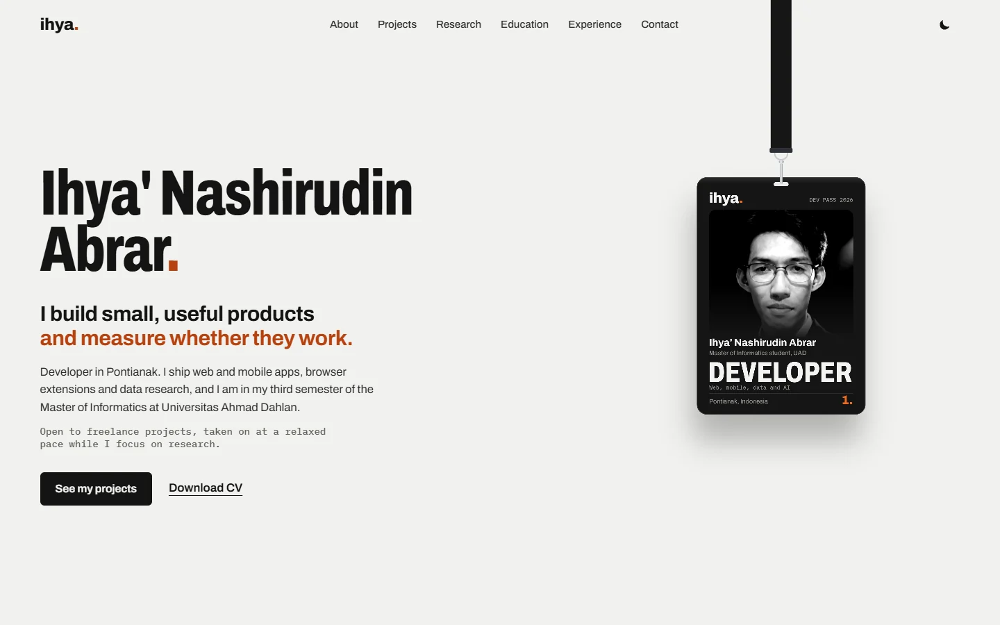

# Ihya' Dev Pass

The portfolio of **Ihya' Nashirudin Abrar**: developer in Pontianak and Master of Informatics student at Universitas Ahmad Dahlan.

**Live site:** https://portfolio-lac-two-c48r69wvj1.vercel.app

<picture>
  <source media="(prefers-color-scheme: dark)" srcset="docs/preview-dark.webp" />
  
</picture>

## The idea

The site is an event pass. The visitor meets a black ID card on a lanyard, as if Ihya' were a speaker at an event named after the portfolio. The rest of the page keeps the same metaphor:

| Section | Shown as |
|---|---|
| Projects | Tickets, with a perforated stub |
| Research | Talks, one per paper |
| Education and Experience | The programme, on a rail that fills as you scroll |
| Contact | The pass you take home, with the CV |

## Things to try on the card

- **Drag** it anywhere; the strap stays attached and the card swings back.
- **Toss** it: let go while moving and it keeps the throw speed.
- **Double-click** (or double-tap) to flip it; keyboard users get a "Flip the ID card" button on focus. The back has a QR code that opens the GitHub profile.
- **Switch the theme** with the moon or sun icon. In the dark theme the card hangs under a spotlight.

## How it is built

| Part | Choice |
|---|---|
| App | Vite 8, React 19, TypeScript |
| 3D | React Three Fiber 9, three.js |
| Physics | Rapier (`@react-three/rapier`), a single rope joint from the pivot to the card clip |
| Strap | `meshline` ribbon drawn along a Hermite curve that sags with the slack |
| Card faces | Drawn with the 2D canvas API, so text stays sharp and the QR code stays scannable |
| Type | Archivo (variable width) and IBM Plex Mono |
| Hosting | Vercel |

A few details that keep it fast and steady:

- The page first shows a static poster of the card at the exact position of the 3D rig. The WebGL chunk loads after the page is idle and replaces it without a jump.
- Card faces use unlit materials, so the card is the same true black as the poster.
- The strap end is read from the rendered clip, not the raw physics state, so it never lags a frame behind the card.
- The gentle sway stops when the system asks for reduced motion.
- Browsers without WebGL keep the poster.

## Project layout

```
src/
  content.ts            all site copy and profile links
  App.tsx               header, theme switch, section order
  components/
    Hero.tsx            headline, poster fallback, sizing of the 3D rig
    Lanyard.tsx         physics, strap, clasp, lighting, camera
    Sections.tsx        about, projects, research, education, experience, tools, contact
  lib/
    cardArt.ts          card front, strap texture, shared rig constants
    cardBack.ts         card back with the QR code
public/                 photo, campus logos, CV
scripts/make_cv.py      generates the CV PDF
DESIGN.md               palette, type and layout rules
```

## Run it locally

Needs Node 20.19 or newer.

```bash
npm install
npm run dev
```

`npm run build` writes the site to `dist/`. During the build:

- The public repository count is read from the GitHub API. Set `GITHUB_TOKEN` to avoid the rate limit; without network it falls back to the last known number.
- On Vercel, the production domain is filled into the Open Graph tags so link previews work. Set `SITE_URL` to use another domain.

## Editing content

- Text, projects, papers, education and links: `src/content.ts`.
- Design rules: `DESIGN.md`.
- CV: edit `scripts/make_cv.py`, then run `python scripts/make_cv.py public/Ihya-Nashirudin-Abrar-CV.pdf` (needs `reportlab`).

## Contact

- GitHub: [ihyaabrar](https://github.com/ihyaabrar)
- LinkedIn: [Ihya' Nashirudin Abrar](https://www.linkedin.com/in/ihya-nashirudin-abrar-9978a6243/)
- ORCID: [0009-0004-3993-3585](https://orcid.org/0009-0004-3993-3585)

The photo and CV are personal. The campus logos belong to their universities.
